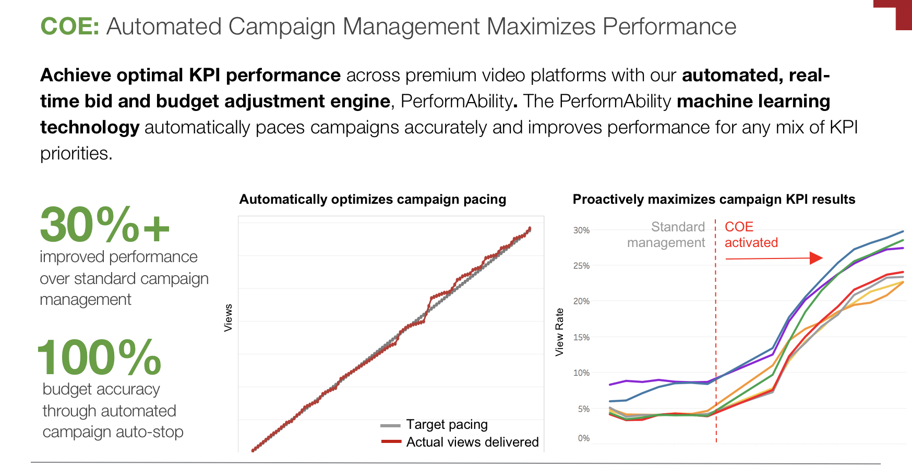
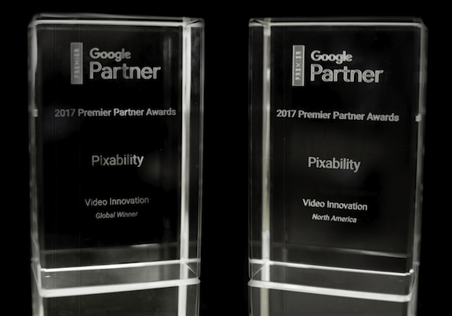
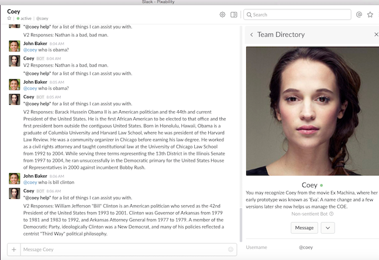

# Building a Scalable Auto-Bidding Prediction Platform
#### Within the Walled Gardens, Eg: YouTube, Facebook, Twitter, et. al.

## Summary

**Problem:** Significantly optimize digital campaign bidding

**Actions:** My team and I created a AI-based tool named Performability or the Campaign Optimization Engine (COE) which auto-bids the most appropriate bid amount for n-number of ad groups.

**Results:**
* Saved the company 25% in media costs per year (> $2M) while at the same time increasing customers' KPIs
* Reduced campaign bidding time by 95% per day
* Won awards from Google and Gartner for Innovation
* The team and I submitted patent US62403367 for approval by the USPTO

My team and I were tasked with increasing efficiency of campaign bidding, which is the core value proposition of Pixability, resulting in company saving $2M in operating costs per year.

## Background

When advertisers run digital marketing campaigns they must log into a platform supported web interface (Google AdWords in the case of YouTube), and manually change the bid price for a given ad group. Adjusting the bid price will vary the number of views acquired. The Campaign Managers (CMs) at Pixability typically consider the past few days' view/bid level combination to guess the bid level needed to achieve the daily view goal for the next day. 

From preliminary analysis performed by the data science team we uncovered that this manual approach caused us to overbid 60% of the time. As well, manually bidding over 100's of campaigns was extremely time consuming even for the most proficient of CM. Imagine doing that everyday, day in, day out. To give you some context, the most complicated campaign that the team managed has over 152 ad groups for a single campaign, which took the CM at least an hour every day to adjust the bid manually. The process was not only time-consuming but also was prone to errors.

Creating a bidding engine to intelligently select bid levels automatically and be able to scale over all active campaigns - it was assumed - would therefore save the company considerable time and money. More than that, the time saved by automatic bidding would free-up time for our CM's to increase their interactions with our customers and attempt to derive higher level user needs. Examples include, with the aggregate bid level data produced by the bidding engine - eg, the levels at which campaigns bid during a given day and the number of views achieved, segmenting campaigns across industry or creative type / length, we can quantitatively recommend to customers when to run certain ads, the time of  year to run them, and which platforms to run them on, all in an effort to achieve our customers' goals more efficiently.

## Objective

With that, we set off to build an auto-bidding engine within the walled gardens, eg, Facebook, Twitter, YouTube and Instagram. The engine would submit daily bids on the ad group level (the hierarchy of a campaign is campaign -> ad group -> ad). 

## User Needs

Working with the Director of Customer Service I distilled the following user needs over the course of a few months and prioritized them for development with the data science team:

The engine should take into consideration all previous bid levels for a given ad-group - yesterday, the day-before, etc.

The engine must scale across all ad-groups within a campaign, across all campaigns (on any platform) for a given customer campaign

The engine must consider the length of the campaign and acquire cumulative views over time, regardless of pacing strategy. Eg, Even Pacing - eg, equally over the campaign length; Banana Pacing, eg, acquiring more views earlier in the campaign - usually at the start of a given month because that's when views are cheapest - and tapering off at the end of the campaign.

For example, consider a fictitious campaign where we needed to acquire 1000 views on YouTube in 10 Days. For the case of Even Pacing, we'd want to acquire 100 per day. For the Banana Pacing case, we'd likely acquire 110 the first few days then the remainder of them over the remaining 8.

The engine must adapt to the Campaign Objective - either acquire a predefined number of views or a certain level of spend over the course of a campaign or both.

The engine must provide feedback on its performance over time for any number of  campaigns

The application must be activated and stopped by non-technical campaign managers

The code must be developed in such a way so as to pass the code and the application's database to Engineering so that it can be incorporated into the external product

## Development

With these high level goals prioritized, the Data Science team started development at the beginning of Q1'16. During that quarter the Engine's name evolved to Campaign Optimization Engine, or COE for short. I architected the Python code infrastructure - classes and methods - within a new COE Github repository. I likewise architected the data model within our Snowflake cluster, creating a new COE schema and requisite bidding tables. 

I also architected and helped build Kafka pipelines which pulled data from Salesforce (for spend related data), AdWords, Facebook and Twitter ad platforms (for view counts and other view related metadata). This data, as well as the views/bid levels data produced natively by the COE itself would help us construct bids levels for current campaigns for the next day. Bids were constructed once per day, for all active ad groups.

I worked with Engineering to plan how Data Science would utilize their new programmatic API's which submits bids within a given ad platform and planned that work for the team.

## Initial Results

Once the new code, data architecture and bidding API integrations were complete we ran the COE on a lone campaign. To ensure there was no false positive bias, the CM's ran the campaign manually for the first two weeks followed by the COE on it for the remaining two. At the end of that campaign I performed the analysis which showed convincingly that the COE was 25% more efficient than the human! I delivered the findings in a Tableau dashboard.

As time went on and we became more confident in the COE's results, we refined the benefits not only to the company (reduced costs), we likewise started conveying the benefits to our customers. Not only did the COE provide cost efficiencies, through subsequent analysis it became clear that increased other metrics important to our customers. See below just one example of View Rate (VR) being improved. 

  

Everyone on the Data Science team has strengths and responsibilities. Among mine is to report out the team's monthly achievements, during the monthly company meeting. Feedback that I've received on the COE has been interesting, impressions have ranged from initial excitement (from almost everyone including the CFO), to concern the COE is killing jobs, to making peace with the technology, and now back to excitement as we show integration of new features. 

## Industry Recognition

Based on this work, Pixability [won awards](https://www.pixability.com/google-awards-pixability-global-award-video-innovation/) for innovation from Google and Gartner in the very first [Google Premier Partner Awards competition](https://premierpartnerawards.withgoogle.com/en/winners).

  

"Pixability emerged victorious as the global winner for video innovation! We were the only North America-based ad tech company to be shortlisted for the video innovation award. In fact, we were the only North American company to win a global award in any category, and the only YouTube Measurement Program partner to be shortlisted for an award."

## Coey
To make the COE more approachable to the CMs and other non-technical folks I developed COEy, our AI Slack bot. COEy enables users to enter simple commands in Slack and receive information about campaigns, brands, the weather, Barack Obama or other conversational information. The bot is essentially coey.py, a Python script which is as of this writing 2153 lines of code and auto-builds charts in Matplotlib and interacts with an API.ai back-end to facilitate contextual conversations.

I've created the coey_example.py script in this directory which shows highly modified version of coey.py so as to not violate any IP from Pixbility. It shows how I connecting her to a local database (build_graphs.py), dialogflow.com (formerly API.ai) and Slack - so she can live in a Slack channel. Below is an example conversation where her responses was generated in diaglogflow.com.

  

While we've added many more features since the initial version, fast forwarding to now and we are supporting over 1500 simultaneous campaigns. The following, non-sensitive, slide shows the benefits of Performability: it achieves optimal pacing while at the same time maximizing customers’ KPI goals. 

## The Heart of the COE

Determining the most appropriate bid level for any given campaign, within context of its objective, pacing type, and many other considerations is achieved through a Recurrent Neural Net using a Long Short Term Memory module. Using this approach not only provides us bid levels for tomorrow, but into the future as well. With this technology we can make inferences on future campaign spend. Eg, within a error range I can tell the CFO how much our marketing spend we'll likely incur for the remainder of the month. 

